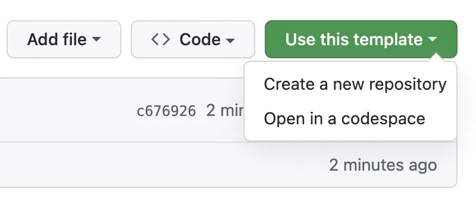
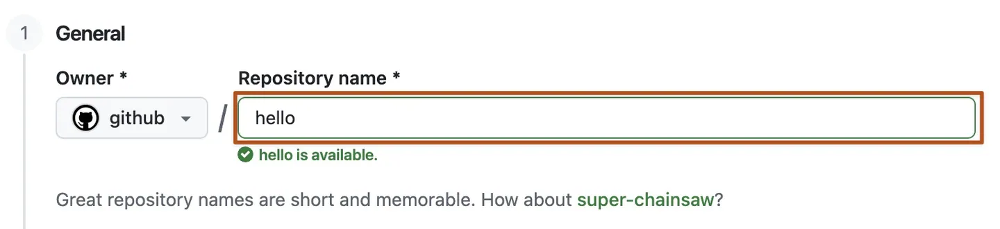
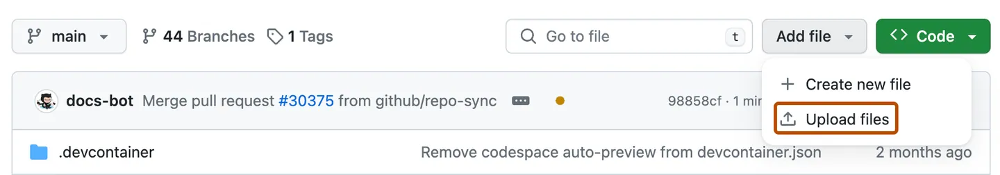
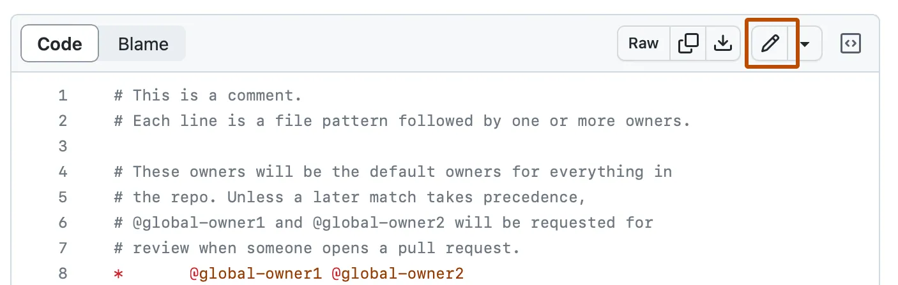
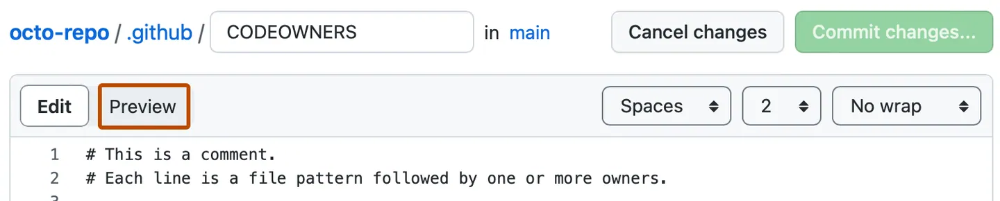
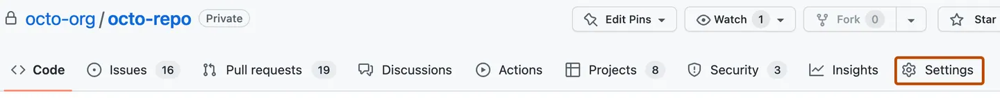

# Prepare your private repository with an image and a short record

Use the [current Japanese setup PDF](../../slides/00_Course_Setup_v1.4.pdf) and [step-by-step companion](../../docs/setup_handson_step_by_step.md). Course forms and notification instructions come from your university course page.

## Joining after the first class

Use the same template and initial registration form even when you join in Week 02 or later. Continue from the step you reached; do not recreate a repository or upload the same files again. The class checks registrations repeatedly, so a late setup is not excluded from verification.

The aim is to save an image and a short record in your private repository and let the instructor check those files. A repository stores files and their change history. The quality of the image is not graded.

## 1. Open the course page with your university Google account

Check the email shown under the account icon. Switch from your personal account to your university account when access is denied; do not request access from your personal email. GitHub uses a separate account.

## 2. Sign in to GitHub and find your username

New users should follow the course account guide and verify their university email. Existing users can keep their account and add and verify their university email. You do not need to put your student number, real name, or university email on your public profile.

If your university email is already registered, do not add it again. This also applies when it is your Primary email address; check that it is marked Verified.

While signed in to GitHub, click the round profile picture in the upper-right corner and open Profile. For a profile URL such as github.com/example-student, the username is example-student. This differs from your display name and email. Write the username down for the initial registration form and compare it with the name you chose in the Username field when signing up.

## 3. Create your private repository from the template

Open the student template from the course page. Select Use this template, then Create a new repository. Choose your own account as Owner, enter ai-learning, and select Private. Use the template function, not Fork. Do not include your student number in the repository name.

Check that the new page shows your username and Private. If it still shows tsuchiyatakahirolab, you are viewing the instructor's repository. Open your own ai-learning. Students who already created it should keep using that repository.

## 4. Save an image on your computer

You may ask an image-capable AI to draw a book and pencil on a desk, without people, text, or logos. When image generation is unavailable, use the practice image supplied with the course. Either option meets the setup requirement.

Save the image and open the downloaded file. Copying the address of a web page does not save the image. The example uses practice.png, but another actual filename is acceptable. Do not change an extension to pretend that an image has been converted to a different format.

## 5. Upload the image to setup

In your ai-learning repository, open setup. Choose Add file, Upload files, and then choose your files. Select the image. Check its filename, enter a message such as Add practice image, and save with Commit changes.

Return to setup and open the uploaded image. Check that it displays the same image as the file on your computer. Upload the actual file rather than attaching an image in a comment or pasting it into the README editor.

## 6. Write the short record

Open setup/README.md and choose the pencil icon. Enter the image filename, the AI you used or the fact that you used the supplied image, and what you checked. Do not paste your entire AI conversation.

For example: I uploaded practice.png using the supplied image. I opened it on GitHub and checked that its text was readable. Describe what you actually did. Select Preview, then save with Commit changes. Editing in the browser does not require a separate push.

## 7. Invite the instructor

Open Settings in your ai-learning repository, then Collaborators and Add people. Search for tsuchiyatakahirolab and check the full username before sending the invitation. Use repository settings, not your general account settings.

This grants the instructor read and write access to this course repository. Do not share your password. A pending invitation means it has been sent. Continue to registration without waiting for individual acceptance. Do not make the repository public to allow the instructor to see it.

## 8. Submit the existing initial registration form

Open the form with your university Google account and check the collected email. Enter your complete student number, such as 2026GT0001, your GitHub username, and the URL of your own repository. This single response links the student number to the GitHub account and submission location.

Initial registration needs the repository URL, not a commit URL. There is no separate Week 00 form. Check the confirmation page after sending the form. Correct registration details through the same form's published instructions.

## 9. Check the result after the next batch check

The instructor's batch check verifies the registration, repository access, image, and short record. Your setup is waiting for a check until that process runs. Follow the course page for result delivery and timing. Where email notifications are enabled, results go only to your university email.

Fix the specific item in a correction notice. File-only changes do not need another registration response; the next check will examine them. Correct registration as well when the username or repository URL was wrong. The same process works for students joining after Week 01.

## Weekly assignments

Read the handout in the instructor's repository and save your answer in the appropriate week folder in your own repository. After saving all required files, open the final commit and submit its URL to the weekly form. Consult the course page for earlier assignments and deadlines; setup verification does not waive them.

A browser bookmark or an optional GitHub Star can help you return to the materials. Stars are not required for grades or setup completion, and stars on public repositories can be seen by others. When asking for help, report where you stopped without revealing passwords, sign-in codes, or secret keys.

## Links

[Student template](https://github.com/tsuchiyatakahirolab/ai-data-literacy-student-template) and [practice image](https://github.com/tsuchiyatakahirolab/ai-data-literacy/blob/main/assets/setup/practice.png). Use Download raw file to save the actual image. University course and form links are available inside the university course page. Self-study readers do not need a university account or course form.

## Finding the buttons

These are screenshots from GitHub official documentation, viewed on 2026-10-06. Their original capture dates are unknown. They show example accounts and files; use your own Owner, ai-learning and setup/README.md. Private student-account operations and the university form have not been photographed. Self-study readers can skip university login, instructor invitation and registration.

### Create from the template

Use this template → Create a new repository.

### Use your own Owner

Enter ai-learning; select Private. Do not use the example Owner github or name hello.

### Upload the actual image

Inside your setup folder: Add file → Upload files.

### Edit your record

Open your setup/README.md and click the pencil.

### Review and save

Preview the three fields, then use Commit changes.

### Invite the instructor

Repository Settings → Collaborators → Add people. Invite tsuchiyatakahirolab.

